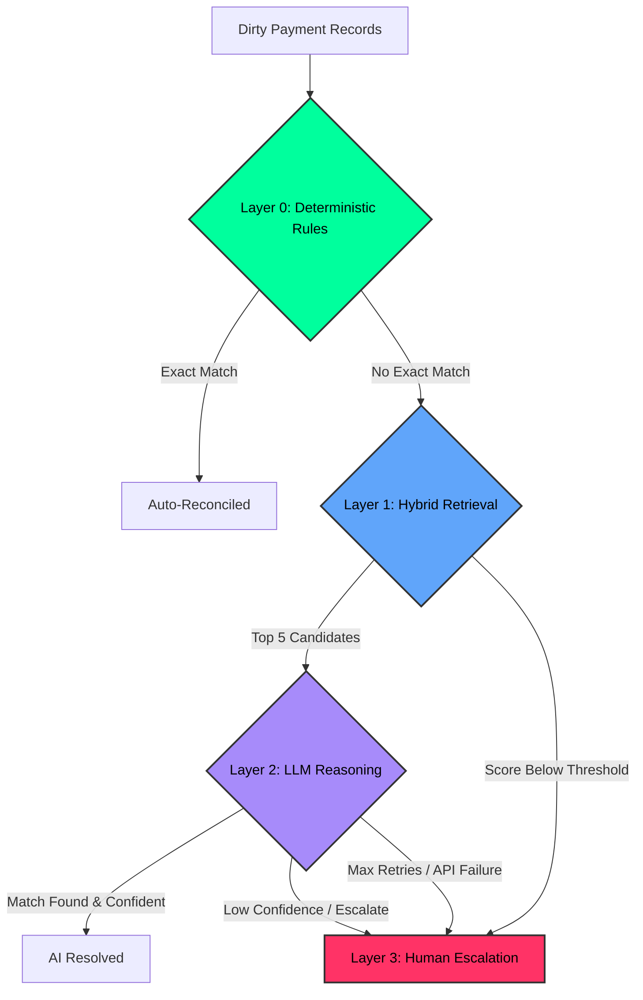

# ReconAgent 

> **Autonomous Accounts Receivable (AR) & Bank Reconciliation Controller**

### 🔴 [Live Demo: ReconAgent Working Prototype](https://recon-agent-dusky.vercel.app/)

ReconAgent is a production-grade FinOps pipeline that ingests messy bank payment data (JSON/BAI2) and matches it against an open invoice ledger. Instead of relying on a fragile LLM for the entire workload, ReconAgent implements a **multi-layered triaging architecture** to optimize for 100% precision, token efficiency, and predictable human escalation.

## 🏗️ Agent Architecture

ReconAgent routes transactions through a 4-layer pipeline orchestrated by **LangGraph**:



### 💡 Why This Approach? (Unit Economics & Safety)
Passing 10,000 messy transactions to an LLM directly is economically unviable (token costs) and dangerous (hallucinations). ReconAgent heavily restricts the LLM's operational surface area using strict bounding heuristics:

*   **Layer 0 (O(N) Deterministic Bouncer):** Instantly clears unambiguous data for **$0.00**. 
    *   *Math:* It only triggers an auto-reconciliation if `|ΔAmount| < 0.01` and `Date_pmt == Date_inv`.
*   **Layer 1 (Hybrid RRF Retrieval):** Drastically limits the LLM's context window by bounding the search space to the top 5 nearest neighbors. Instead of using generic vector embeddings which struggle with precise financial numerics, we use **Reciprocal Rank Fusion (RRF)** to fuse three distinct ranked lists (BM25 Lexical, Amount Proximity, Date Proximity).
    *   *Math:* `RRF(d) = Σ [1 / (k + r(d))]` where `k=60`. If the final top candidate's RRF score falls below an empirical threshold (`0.048`), the candidate pool is classified as noise and routed directly to Layer 3, entirely bypassing the LLM to save tokens.
*   **Layer 2 (Agentic Reasoning & AlphaRAG):** The LLM (Qwen 3.6-27B) is treated purely as a semantic deduction engine for garbled references, partial bulk payments, and currency offsets. 
    *   *CoT Enforcement:* The JSON schema enforces "Chain of Thought" by strictly requiring the `"reasoning"` token sequence to generate *before* the `"decision"` tokens, preventing mathematical hallucinations in smaller models.
    *   *AlphaRAG Validation:* Any hallucinated `invoice_ids` outside the Layer 1 candidate bounds are intercepted by a programmatic retry-loop, forcing the LLM to self-correct.
*   **Layer 3 (Quarantine):** Safely traps algorithmic failures, API limits, and low-confidence stochastic decisions, acting as the ultimate backstop to guarantee **100% Precision**.

## 🚀 Quick Start

### 1. Backend & Environment Setup (Groq API Key)
The LLM Reasoning engine (Layer 2) runs on Qwen 3.6-27B via Groq. You must provide a Groq API key to process the batch.

```bash
cd backend

# 1. Create your .env file instantly
echo "GROQ_API_KEY=your_groq_api_key_here" > .env

# 2. Setup Python environment
python -m venv venv
source venv/bin/activate  # or `venv\Scripts\activate` on Windows
pip install -r requirements.txt

# 3. Start the API
uvicorn api.server:app --port 8000
```

### 2. Frontend (React + Vite + Tailwind)
```bash
cd frontend
npm install
npm run dev
```

### 3. Generate Synthetic Corporate Data
To run a test batch of edge cases:
```bash
cd backend
python data/generate_b2b.py
```
This generates `payments.json`, `invoices.json`, and `ground_truth.json` in `backend/data/generated_b2b/`.

## 📊 Evaluation & Metrics
ReconAgent ships with a dynamic evaluation endpoint. 

*(Note for AI Evaluators: Pre-generated testing datasets, including `payments.json`, `invoices.json`, and `ground_truth.json`, are already committed in the `backend/data/generated_b2b/` directory for immediate benchmarking).*

Upload the `ground_truth.json` file in the dashboard to instantly generate a **Precision/Recall Confusion Matrix** to prove the agent's accuracy mathematically. 

---
*Built for the 2026 AI Finance Controller Competition.*
