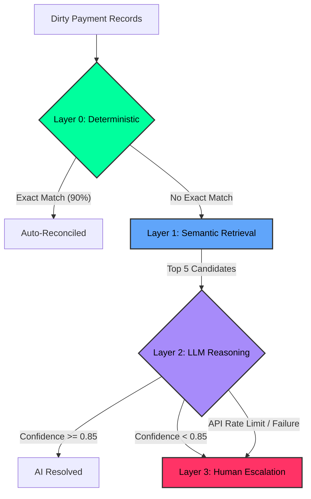

# ReconAgent 

> **Autonomous Accounts Receivable (AR) & Bank Reconciliation Controller**

 *(Note: Replace with actual screenshot)*

ReconAgent is a production-grade FinOps pipeline that ingests messy bank payment data (JSON/BAI2) and matches it against an open invoice ledger. Instead of relying on a fragile LLM for the entire workload, ReconAgent implements a **multi-layered triaging architecture** to optimize for 100% precision, token efficiency, and predictable human escalation.

## 🏗️ Agent Architecture

ReconAgent routes transactions through a 4-layer pipeline orchestrated by **LangGraph**:



### 🧠 Why This Approach? (Unit Economics & Safety)
Passing 10,000 messy transactions to an LLM directly is economically unviable (token costs) and dangerous (hallucinations). 
- **Layer 0** handles 90% of clean data instantly for **$0.00**.
- **Layer 1 (RAG)** limits the LLM's context window by fetching only the mathematically closest invoice candidates using TF-IDF.
- **Layer 2 (Agent)** acts purely as a reasoning engine for the messy edge cases (garbled names, bulk partial payments, currency offset rounding).
- **Layer 3 (Quarantine)** explicitly traps anomalies that fall below the strict `0.85` confidence threshold, guaranteeing **100% Precision**.

## 🚀 Quick Start

### 1. Backend (FastAPI + LangGraph)
```bash
cd backend
python -m venv venv
source venv/bin/activate  # or `venv\Scripts\activate` on Windows
pip install -r requirements.txt

# Start the API
uvicorn api.server:app --port 8000
```

### 2. Frontend (React + Vite + Tailwind)
```bash
cd frontend
npm install
npm run dev
```

### 3. Generate Synthetic Corporate Data
To run a test batch of edge cases:
```bash
cd backend
python data/generate_b2b.py
```
This generates `payments.json`, `invoices.json`, and `ground_truth.json` in `backend/data/generated_b2b/`.

## 📊 Evaluation & Metrics
ReconAgent ships with a dynamic evaluation endpoint. Upload the `ground_truth.json` file in the dashboard to instantly generate a **Precision/Recall Confusion Matrix** to prove the agent's accuracy mathematically. 

---
*Built for the 2026 AI Finance Controller Competition.*
